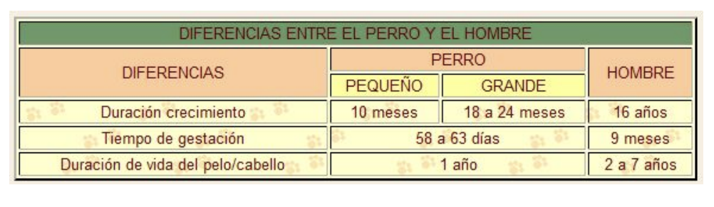

RETO 11:
1. Crear el documento donde.htm, en la carpeta deportes.
2. Modificar la página para colocar la lista de centros en una tabla como esta:

3. Rectificar la tabla para que las celdas de la primera fila sean títulos de columna guardar en el documento donde2.htm.
4. Guardar los cambios y comprobar el funcionamiento en un navegador.

RETO 12:
1. Crear el documento instalaciones.htm en la carpeta deportes.
2. Crear la tabla que aparece para dejarla así:

3. Guardar los cambios y comprobar el funcionamiento en un navegador.

RETO 13:

RETO 14:

RETO 15:

RETO 16:
En el documento que has abierto vamos a crear la siguiente tabla:

RETO 17:
Crea el código html necesario paragenerar la siguiente página web.

RETO 18:
Background
Crea el código html necesario para generar la siguiente página web.
Recuerda que estos tres 
 han de aparecer en la misma página html.

RETO 19:

RETO 20:
Debes crear una página web que tenga el mismo aspecto que la siguiente imagen:
